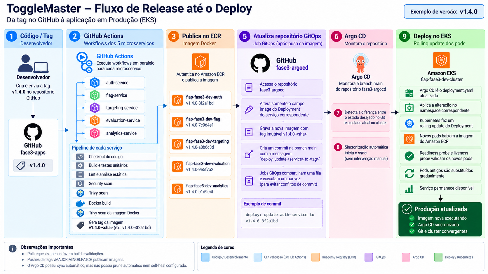

# fase3-apps

## Status dos builds

Cada microsserviço possui um workflow independente no GitHub Actions. Os
indicadores abaixo refletem o estado do build na branch `main`:

| Microsserviço | Build |
| --- | --- |
| auth-service |  |
| flag-service |  |
| targeting-service |  |
| evaluation-service |  |
| analytics-service |  |

Verde significa que o último workflow terminou com sucesso; vermelho indica
falha. Clique no indicador para consultar os detalhes da execução.

## Diagrama do CI/CD

## Tags das imagens no ECR

Os cinco pipelines publicam imagens com o formato `<versão>-<sha de 7 caracteres>`,
por exemplo `v1.0.0-a1b2c3d`. A versão vem da tag Git `vMAJOR.MINOR.PATCH`
mais próxima no histórico do commit; enquanto não houver tags, usam `v1.0.0`.

Pushes na `main` publicam os serviços selecionados pelos filtros de caminhos.
Pushes de tags `v*` executam os cinco pipelines e publicam as imagens da versão,
após as verificações existentes. Pull requests apenas constroem e validam.
Tags de versão fora do formato `vMAJOR.MINOR.PATCH` interrompem a publicação.

As imagens já existentes no ECR mantêm suas tags. O novo padrão passa a valer
quando os workflows atualizados forem executados no GitHub.

## Atualização automática do Argo CD

Após o push da imagem no ECR, cada pipeline atualiza somente a imagem do seu
serviço em `services/<serviço>/deployment.yaml`, na branch `main` de
`monyzevisoto-source/fase3-argocd`, e cria um commit `deploy: update ...`.
O Argo CD aplica a alteração pela sincronização automática já configurada.
Pull requests não atualizam o repositório GitOps.

Configure o secret **ARGOCD_REPO_TOKEN** em **fase3-apps → Settings → Secrets
and variables → Actions**. Use um token fine-grained com acesso ao repositório
`fase3-argocd` e permissão **Contents: Read and write**. O usuário do token deve
poder fazer commits na `main` conforme as regras de proteção dessa branch.
O `GITHUB_TOKEN` padrão de `fase3-apps` não concede escrita no outro repositório.

A atualização usa `fjogeleit/yaml-update-action` v0.17.0, fixada pelo SHA,
com checkout do repositório GitOps e seleção do container pelo nome.
Se a imagem já estiver atualizada, nenhum commit é criado. Novas execuções de
publicação cancelam execuções anteriores do mesmo workflow; PRs têm grupos separados.
A action reserializa o YAML, podendo ajustar a formatação e remover comentários.

Os jobs GitOps dos cinco serviços compartilham uma fila (`queue: max`) e executam
um por vez, evitando conflitos entre seus commits. Builds continuam em paralelo.
O push não usa force. Se houver conflito com uma edição externa ou falha de permissão,
o pipeline falha e deve ser executado novamente; a imagem permanece no ECR.
